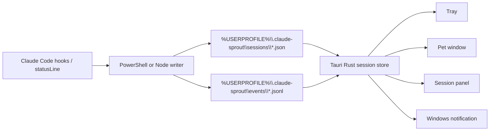

# Claude Sprout

Claude Sprout is a Windows-first desktop companion for Claude Code CLI sessions. It is not a Claude Code replacement and does not approve permissions for you. It watches lightweight local status files written by Claude Code hooks/statusline scripts, then shows session state through a tray entry, a small always-on-top desktop pet, a secondary session panel, and native notifications.

The MVP optimizes for low idle overhead, local-only data, and fast attention cues when Claude Code needs human input.

## Features

- Track multiple Claude Code sessions from local JSON snapshots.
- Display `idle`, `running`, `tool_running`, `waiting_permission`, `waiting_input`, `done`, `error`, `stale`, `probably_closed`, and `closed`.
- Message mode only interrupts for permission, completion, and failure; Board mode keeps a persistent multi-session stack visible.
- Session panel with project name, cwd, session id, status, last event, last tool, heartbeat, context usage, and update time.
- Tauri v2 tray with panel entry, refresh, settings, Do Not Disturb, data-folder, and quit menu items.
- Tauri pet window configured as transparent, frameless, always-on-top, and hidden from the taskbar.
- PowerShell hook/statusline writers for Windows, with Node.js fallback scripts.
- Local status directory at `%USERPROFILE%\.claude-sprout`.
- Codex-compatible custom pet importer for folders containing `pet.json` and `spritesheet.webp`.
- Windows release scripts for the standalone exe and NSIS installer, plus release doctor and smoke tooling.

## Architecture



## Data Layout

```text
%USERPROFILE%\.claude-sprout\
  sessions\
    <session_id>.json
  events\
    <session_id>.jsonl
  pets\
    <pet_id>\
      manifest.json
      spritesheet.webp
  settings.json
```

## Development

Requirements:

- Windows 11 recommended.
- Node.js 20+.
- Rust stable and Tauri v2 prerequisites for native app builds.
- npm is currently used because this environment did not have `pnpm` installed.

Install and run the web preview:

```powershell
npm install
npm run dev
```

The Vite page is only a development preview. The intended desktop shape is the Tauri `pet` window: a small transparent floating component above other apps. The full session panel is secondary and opens from the pet or tray.

Run the Tauri app after Rust is installed:

```powershell
npm run tauri:dev
```

Build the frontend:

```powershell
npm run build
```

Build official Windows release artifacts:

```powershell
npm run release:exe
npm run release:nsis
```

See [docs/release-checklist.md](docs/release-checklist.md) before creating a tagged release.

## Claude Code Hooks / Statusline

Claude Code command hooks receive JSON on stdin. Claude Code status lines also receive JSON on stdin and are configured through `statusLine` in `~/.claude/settings.json`.

Use the example at [hooks/windows/claude-settings.example.json](hooks/windows/claude-settings.example.json) as a patch reference. Replace `C:/path/to/claude-sprout` with this checkout path using forward slashes, and keep quotes around the `.ps1` path if the checkout path contains spaces.

Do not overwrite your existing settings blindly. If `CLAUDE_CONFIG_DIR` is set, Claude Code reads `<CLAUDE_CONFIG_DIR>\settings.json`; otherwise it reads `~/.claude/settings.json`. Back it up first and merge the `hooks` plus `statusLine` sections intentionally.

## Session Status and Pet Modes

From a Claude Code user's point of view, Claude Sprout watches two configured Claude Code integration points:

- Command hooks run when something semantic happens in Claude Code: a session starts, you submit a prompt, a tool starts or finishes, Claude Code asks for permission, the turn stops, a failure happens, or the session ends. On Windows the default writer is [hooks/windows/claude-sprout-hook.ps1](hooks/windows/claude-sprout-hook.ps1); [hooks/node/claude-sprout-hook.js](hooks/node/claude-sprout-hook.js) is the fallback.
- The statusline writer runs repeatedly while Claude Code is alive and rendering its prompt/status line. It refreshes heartbeat, context percentage, display name, and the latest preserved status. This is how Claude Sprout can tell the difference between an active quiet session and one whose heartbeat has stopped.

Claude Sprout does not ask Claude Code for a live session list. It reads local snapshots under `%USERPROFILE%\.claude-sprout\sessions`.

| User-facing moment | Claude Code signal | Stored status | Meaning | Message mode | Board mode / panel | Notification and pet behavior |
|---|---|---|---|---|---|---|
| A Claude Code session starts | `SessionStart` | `idle` | The session exists but no work is currently in progress. | No card. | Shows as a quiet session. | No notification; pet idles. |
| You submit a prompt | `UserPromptSubmit` | `running` | Claude Code accepted your request and is working. | No card. | Shows as running. | No notification; pet uses running animation. |
| Claude Code starts a tool call | `PreToolUse` | `tool_running` | A tool is about to run or is running. | No card. | Shows as running, with tool metadata when available. | No notification; pet uses running animation. |
| A tool finishes and Claude continues | `PostToolUse` | `running` | The tool returned and Claude is continuing the turn. | No card. | Shows as running. | No notification; pet stays in running animation. |
| Claude Code asks for permission | `PermissionRequest` or `Notification: permission_prompt` | `waiting_permission` | User approval is needed before work can continue. | Persistent intervention card until acknowledged. | Highest-priority card. | Native notification when Do Not Disturb is off; pet waves once, then uses waiting animation. |
| Claude Code returns to the prompt and may be ready for the next message | `Notification: idle_prompt` | `waiting_input` | Weak signal that the session may be waiting for a reply. This can be noisy in practice. | No card. | Visible as a low-priority weak state. | No native notification, no action count, no waiting animation; pet idles. |
| Claude Code cleanly stops the current turn/task | `Stop` | `done` | The current response/task finished cleanly. The same session can become `running` again if you send another prompt. | Completion card. It disappears after the configured completion-card duration; `0` keeps it until acknowledged. | Shows as completed while the snapshot remains open. | Native notification when Do Not Disturb is off; pet jumps once, then idles. |
| A tool or turn fails | `PostToolUseFailure` or `StopFailure` | `error` | The current turn failed or Claude Code reported a failed stop. | Persistent failure card until acknowledged. | High-priority failure card. | Native notification when Do Not Disturb is off; pet plays failed once, then uses failed animation while this is the top status. |
| Claude Code explicitly ends the session | `SessionEnd` | `closed` | The terminal session ended. | No card. | Hidden from the pet Board; still available in the full session panel. | No notification; pet idles unless another session has higher priority. |
| Heartbeat stops for more than 2 minutes | derived by the app | `stale` | Claude Sprout has not seen a recent statusline heartbeat for a non-terminal/non-strong state. | No card. | Shows as stale, low priority. | No notification; pet idles. |
| Heartbeat stops for more than 10 minutes | derived by the app | `probably_closed` | The session likely closed without a clean `SessionEnd`. | No card. | Shows as probably closed, low priority. | No notification; pet idles. |

Strong and terminal states are preserved as-is when the app reads snapshots: `waiting_permission`, `done`, `error`, and `closed` do not become `stale` or `probably_closed` just because they are old.

Message mode is the low-disturb mode. It keeps the pet compact and only shows rich message cards for `waiting_permission`, `done`, and `error`. Each card includes session identity, a detail line, and metadata so you can tell which Claude Code session needs attention. If conversation preview is enabled in Settings, Message cards may show a short bounded transcript preview; when it is off, cards stay metadata-only.

Message-card lifetime rules:

- `waiting_permission`: stays until you acknowledge it or the session changes state.
- `error`: stays until you acknowledge it or the session changes state.
- `done`: uses the Settings completion-card duration. `0` means keep completion cards until acknowledged.
- `waiting_input`, `running`, `tool_running`, `idle`, `stale`, `probably_closed`, and `closed`: never create Message cards.

Board mode is the persistent overview mode. It keeps a configurable number of non-closed sessions visible in the pet window, with pager controls when there are more. Cards are sorted by urgency: permission, error, tool running, running, done, weak input wait, stale, probably closed, then idle. Clicking a card opens the full session panel.

Maintainers: when hook mappings, status derivation, notification policy, or Message/Board behavior changes, update this section and [README.zh-CN.md](README.zh-CN.md) in the same change.

## Codex-Compatible Pet Importer

Claude Sprout can scan:

- `%USERPROFILE%\.codex\pets`
- `%CODEX_HOME%\pets` when `CODEX_HOME` is set

The importer expects custom pet packages shaped like:

```text
<pet-id>/
  pet.json
  spritesheet.webp
```

Imported pets are copied into `%USERPROFILE%\.claude-sprout\pets`; the app does not keep a long-term dependency on the Codex source directory. The first atlas profile is `codex-8x9`.

Claude Sprout does not include, copy, or distribute official Codex pet assets. Only import custom pet packages you own or have permission to use. Codex is an OpenAI product name; this project is not affiliated with OpenAI.

## Privacy

Claude Sprout is local-first:

- No network sync by default.
- No prompt/output capture by default.
- No remote command execution.
- No automatic permission approval.
- Session metadata remains under `%USERPROFILE%\.claude-sprout` unless you move it.

See [docs/privacy.md](docs/privacy.md).

## Disclaimer

Claude Sprout is an independent open-source project. It is not affiliated with Anthropic, Claude Code, OpenAI, or Codex.

## Roadmap

- Add file watching with debounce instead of UI polling.
- Prepare and publish the first tagged Windows release.
- Add signed release flow.
- Add GitHub Actions release builds.
- Add optional wrapper/PID enhancement for process-level closed detection.

## License

MIT
