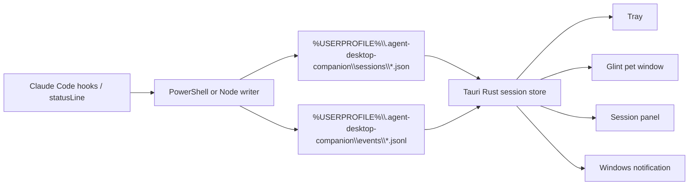

# Agent Desktop Companion

Agent Desktop Companion is a Windows-first, local-first AI Agent desktop companion workbench. Its primary surface is **Glint**, a small always-on-top desktop pet that gives low-noise reminders when local agent sessions are running, finished, failed, or waiting for human input.

The current app focuses on Claude Code CLI sessions through local hook/statusline files. The product direction is broader: one quiet desktop companion for AI agent session state, reminders, skills, API configuration, and local data.

## Features

- Track multiple Claude Code sessions from local JSON snapshots.
- Display `idle`, `running`, `tool_running`, `waiting_permission`, `waiting_input`, `done`, `error`, `stale`, `probably_closed`, and `closed`.
- Message mode only interrupts for permission, completion, and failure; Board mode keeps a persistent multi-session stack visible.
- Glint built-in pet: a winged luminous technology sprite using the Codex/Hatch 8x9 atlas contract.
- Session panel with project, cwd, session id, status, last event, last tool, heartbeat, context usage, and update time.
- Tauri v2 tray with panel entry, refresh, settings, Do Not Disturb, data-folder, and quit menu items.
- Transparent, frameless, always-on-top pet window hidden from the taskbar.
- PowerShell hook/statusline writers for Windows, with Node.js fallback scripts.
- Local status directory at `%USERPROFILE%\.agent-desktop-companion`.
- Legacy read compatibility for `CLAUDE_SPROUT_HOME` and `%USERPROFILE%\.claude-sprout`.
- Codex-compatible custom pet importer for folders containing `pet.json` and `spritesheet.webp`.
- Windows release scripts for the standalone exe and NSIS installer, plus release doctor and smoke tooling.

## Architecture



## Data Layout

```text
%USERPROFILE%\.agent-desktop-companion\
  sessions\
    <session_id>.json
  events\
    <session_id>.jsonl
  pets\
    <pet_id>\
      manifest.json
      spritesheet.webp
  settings.json
```

Compatibility:

- Set `AGENT_DESKTOP_COMPANION_HOME` to override the data root.
- If `CLAUDE_SPROUT_HOME` is set, the app and new hooks continue to use it.
- If the new default directory does not exist but `%USERPROFILE%\.claude-sprout` exists, the app reads the legacy directory.
- The app does not automatically move or delete legacy local data.

## Development

Requirements:

- Windows 11 recommended.
- Node.js 20+.
- Rust stable and Tauri v2 prerequisites for native app builds.
- npm is used in this repository.

Install and run the web preview:

```powershell
npm install
npm run dev
```

The Vite page is only a development preview. The intended desktop shape is the Tauri `pet` window: a small transparent floating component above other apps. The full session panel is secondary and opens from Glint or the tray.

Run the Tauri app after Rust is installed:

```powershell
npm run tauri:dev
```

Build the frontend:

```powershell
npm run build
```

Build official Windows release artifacts:

```powershell
npm run release:exe
npm run release:nsis
```

See [docs/release-checklist.md](docs/release-checklist.md) before creating a tagged release.

## Claude Code Hooks / Statusline

Claude Code command hooks receive JSON on stdin. Claude Code status lines also receive JSON on stdin and are configured through `statusLine` in `~/.claude/settings.json`.

Use the example at [hooks/windows/claude-settings.example.json](hooks/windows/claude-settings.example.json) as a patch reference. Replace `C:/path/to/agent-desktop-companion` with this checkout path using forward slashes, and keep quotes around the `.ps1` path if the checkout path contains spaces.

New canonical files:

- [hooks/windows/agent-desktop-companion-hook.ps1](hooks/windows/agent-desktop-companion-hook.ps1)
- [hooks/windows/agent-desktop-companion-statusline.ps1](hooks/windows/agent-desktop-companion-statusline.ps1)
- [hooks/node/agent-desktop-companion-hook.js](hooks/node/agent-desktop-companion-hook.js)
- [hooks/node/agent-desktop-companion-statusline.js](hooks/node/agent-desktop-companion-statusline.js)

Legacy `claude-sprout-*` hook files are kept as wrappers for one release cycle so existing Claude Code settings do not break immediately.

Do not overwrite your existing settings blindly. If `CLAUDE_CONFIG_DIR` is set, Claude Code reads `<CLAUDE_CONFIG_DIR>\settings.json`; otherwise it reads `~/.claude/settings.json`. Back it up first and merge the `hooks` plus `statusLine` sections intentionally.

## Session Status and Pet Modes

From a Claude Code user's point of view, Agent Desktop Companion watches two configured Claude Code integration points:

- Command hooks run when something semantic happens in Claude Code: a session starts, you submit a prompt, a tool starts or finishes, Claude Code asks for permission, the turn stops, a failure happens, or the session ends.
- The statusline writer runs repeatedly while Claude Code is alive and rendering its prompt/status line. It refreshes heartbeat, context percentage, display name, and the latest preserved status.

Agent Desktop Companion does not ask Claude Code for a live session list. It reads local snapshots under `%USERPROFILE%\.agent-desktop-companion\sessions`, or the compatible legacy root described above.

| User-facing moment | Claude Code signal | Stored status | Message mode | Board mode / panel | Notification and Glint behavior |
|---|---|---|---|---|---|
| Session starts | `SessionStart` | `idle` | No card. | Quiet session. | No notification; Glint idles. |
| Prompt submitted | `UserPromptSubmit` | `running` | No card. | Running. | No notification; running animation. |
| Tool starts | `PreToolUse` | `tool_running` | No card. | Running with tool metadata. | No notification; running animation. |
| Tool finishes and Claude continues | `PostToolUse` | `running` | No card. | Running. | No notification; running animation. |
| Permission required | `PermissionRequest` or `Notification: permission_prompt` | `waiting_permission` | Persistent intervention card. | Highest-priority card. | Native notification when DND is off; Glint waves once, then waits. |
| Prompt is idle and may need reply | `Notification: idle_prompt` | `waiting_input` | No card. | Low-priority weak state. | No native notification, no action count, no waiting animation. |
| Turn/task finished | `Stop` | `done` | Completion card. | Completed while snapshot remains open. | Native notification when DND is off; Glint jumps once, then idles. |
| Tool or turn failed | `PostToolUseFailure` or `StopFailure` | `error` | Persistent failure card. | High-priority failure card. | Native notification when DND is off; failed animation. |
| Session ended | `SessionEnd` | `closed` | No card. | Hidden from Board; visible in panel history. | No notification; Glint idles unless another session needs attention. |
| Heartbeat stops for 2+ minutes | derived by app | `stale` | No card. | Low priority. | No notification; Glint idles. |
| Heartbeat stops for 10+ minutes | derived by app | `probably_closed` | No card. | Low priority. | No notification; Glint idles. |

Strong and terminal states are preserved as-is when the app reads snapshots: `waiting_permission`, `done`, `error`, and `closed` do not become `stale` or `probably_closed` just because they are old.

Message mode is the low-disturb mode. It keeps the pet compact and only shows rich message cards for `waiting_permission`, `done`, and `error`. Board mode is the persistent overview mode. It keeps a configurable number of non-closed sessions visible in the pet window, with pager controls when there are more.

## Codex-Compatible Pet Importer

Agent Desktop Companion can scan:

- `%USERPROFILE%\.codex\pets`
- `%CODEX_HOME%\pets` when `CODEX_HOME` is set

The importer expects custom pet packages shaped like:

```text
<pet-id>/
  pet.json
  spritesheet.webp
```

Imported pets are copied into `%USERPROFILE%\.agent-desktop-companion\pets` by default; the app does not keep a long-term dependency on the Codex source directory. The first atlas profile is `codex-8x9`.

Agent Desktop Companion does not include, copy, or distribute official Codex pet assets. Only import custom pet packages you own or have permission to use. Codex is an OpenAI product name; this project is not affiliated with OpenAI.

## Privacy

Agent Desktop Companion is local-first:

- No network sync by default.
- No prompt/output capture by default.
- No remote command execution.
- No automatic permission approval.
- Session metadata remains under the local data root unless you move it.

See [docs/privacy.md](docs/privacy.md).

## Disclaimer

Agent Desktop Companion is an independent open-source project. It is not affiliated with Anthropic, Claude Code, OpenAI, or Codex.

## Roadmap

- Add file watching with debounce instead of UI polling.
- Extend the companion workbench beyond Claude Code session state.
- Add API and skill management surfaces after the pet-first workflows settle.
- Prepare and publish the first tagged Windows release.
- Add signed release flow and GitHub Actions release builds.

## License

MIT
