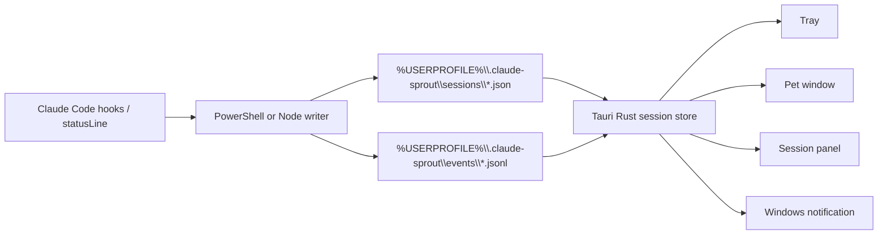

# Claude Sprout

Claude Sprout is a Windows-first desktop companion for Claude Code CLI sessions. It is not a Claude Code replacement and does not approve permissions for you. It watches lightweight local status files written by Claude Code hooks/statusline scripts, then shows session state through a tray entry, a small desktop pet, a session panel, and native notifications.

The MVP optimizes for low idle overhead, local-only data, and fast attention cues when Claude Code needs human input.

## Features

- Track multiple Claude Code sessions from local JSON snapshots.
- Display `idle`, `running`, `tool_running`, `waiting_permission`, `waiting_input`, `done`, `error`, `stale`, `probably_closed`, and `closed`.
- Strong visual reminder for `waiting_permission`; lighter cues for `waiting_input`; notifications for `done` and `error`.
- Session panel with project name, cwd, session id, status, last event, last tool, heartbeat, context usage, and update time.
- Tauri v2 tray skeleton with panel entry, refresh, settings, and quit menu items.
- PowerShell hook/statusline writers for Windows, with Node.js fallback scripts.
- Local status directory at `%USERPROFILE%\.claude-sprout`.
- Codex-compatible custom pet importer skeleton for folders containing `pet.json` and `spritesheet.webp`.

## Architecture



## Data Layout

```text
%USERPROFILE%\.claude-sprout\
  sessions\
    <session_id>.json
  events\
    <session_id>.jsonl
  pets\
    <pet_id>\
      manifest.json
      spritesheet.webp
  config.json
```

## Development

Requirements:

- Windows 11 recommended.
- Node.js 20+.
- Rust stable and Tauri v2 prerequisites for native app builds.
- npm is currently used because this environment did not have `pnpm` installed.

Install and run the web preview:

```powershell
npm install
npm run dev
```

Run the Tauri app after Rust is installed:

```powershell
npm run tauri:dev
```

Build the frontend:

```powershell
npm run build
```

## Claude Code Hooks / Statusline

Claude Code command hooks receive JSON on stdin. Claude Code status lines also receive JSON on stdin and are configured through `statusLine` in `~/.claude/settings.json`.

Use the example at [hooks/windows/claude-settings.example.json](hooks/windows/claude-settings.example.json) as a patch reference. Replace `C:/path/to/claude-sprout` with this checkout path using forward slashes.

Do not overwrite your existing `~/.claude/settings.json` blindly. Back it up first and merge the `hooks` plus `statusLine` sections intentionally.

## Codex-Compatible Pet Importer

Claude Sprout can scan:

- `%USERPROFILE%\.codex\pets`
- `%CODEX_HOME%\pets` when `CODEX_HOME` is set

The importer expects custom pet packages shaped like:

```text
<pet-id>/
  pet.json
  spritesheet.webp
```

Imported pets are copied into `%USERPROFILE%\.claude-sprout\pets`; the app does not keep a long-term dependency on the Codex source directory. The first atlas profile is `codex-8x9`.

Claude Sprout does not include, copy, or distribute official Codex pet assets. Only import custom pet packages you own or have permission to use. Codex is an OpenAI product name; this project is not affiliated with OpenAI.

## Privacy

Claude Sprout is local-first:

- No network sync by default.
- No prompt/output capture by default.
- No remote command execution.
- No automatic permission approval.
- Session metadata remains under `%USERPROFILE%\.claude-sprout` unless you move it.

See [docs/privacy.md](docs/privacy.md).

## Disclaimer

Claude Sprout is an independent open-source project. It is not affiliated with Anthropic, Claude Code, OpenAI, or Codex.

## Roadmap

- Finish Tauri tray commands and native notifications.
- Add file watching with debounce instead of UI polling.
- Add detachable transparent pet window with position lock.
- Add full Codex-compatible pet preview and import UI.
- Add settings UI for cleanup TTL, do-not-disturb, and always-on-top.
- Add Windows installer and release workflow.

## License

MIT
