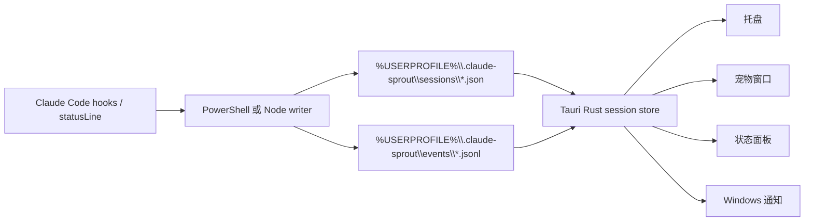

# Claude Sprout

Claude Sprout 是一个 Windows 优先的 Claude Code CLI 桌面伴随工具。它不是 Claude Code 替代品，也不会替你自动审批权限。它通过 Claude Code hooks/statusline 写入的本地轻量状态文件，聚合展示多个会话状态，并用托盘、置顶悬浮小宠物窗口、辅助状态面板和系统通知提醒你及时介入。

MVP 的工程目标是低资源占用、本地优先、权限等待时提醒足够明显。

## 功能

- 从本地 JSON snapshot 跟踪多个 Claude Code session。
- 展示 `idle`、`running`、`tool_running`、`waiting_permission`、`waiting_input`、`done`、`error`、`stale`、`probably_closed`、`closed`。
- `waiting_permission` 强提醒，`waiting_input` 轻提醒，`done/error` 系统通知。
- 状态面板展示 project name、cwd、session id、status、last event、last tool、heartbeat、context usage、updated time。
- Tauri v2 托盘骨架：打开面板、刷新、设置、退出。
- Tauri 宠物窗口配置为透明、无边框、置顶，并从任务栏隐藏。
- Windows PowerShell hook/statusline writer，另有 Node.js fallback。
- 本地状态目录：`%USERPROFILE%\.claude-sprout`。
- Codex-compatible 自定义宠物导入骨架，支持 `pet.json` + `spritesheet.webp` 包结构。

## 架构



## 数据目录

```text
%USERPROFILE%\.claude-sprout\
  sessions\
    <session_id>.json
  events\
    <session_id>.jsonl
  pets\
    <pet_id>\
      manifest.json
      spritesheet.webp
  config.json
```

## 开发运行

要求：

- 推荐 Windows 11。
- Node.js 20+。
- 如需运行原生桌面端，需要 Rust stable 和 Tauri v2 前置依赖。
- 当前环境没有 `pnpm`，所以项目先使用 `npm`。

运行 Web 预览：

```powershell
npm install
npm run dev
```

Vite 页面只是开发预览。真正的桌面形态是 Tauri 的 `pet` 窗口：一个透明、无边框、悬浮在其他应用之上的轻量组件。完整状态面板只是辅助窗口，通过点击宠物或托盘打开。

安装 Rust 后运行 Tauri：

```powershell
npm run tauri:dev
```

构建前端：

```powershell
npm run build
```

## Claude Code Hooks / Statusline

Claude Code command hooks 会从 stdin 接收 JSON。statusline 同样从 stdin 接收 JSON，并通过 `~/.claude/settings.json` 里的 `statusLine` 配置。

参考 [hooks/windows/claude-settings.example.json](hooks/windows/claude-settings.example.json)。使用时把 `C:/path/to/claude-sprout` 替换成当前仓库路径，并建议使用正斜杠路径。

不要直接覆盖现有 `~/.claude/settings.json`。请先备份，再把 `hooks` 和 `statusLine` 配置合并进去。

## Codex-Compatible Pet Importer

Claude Sprout 会扫描：

- `%USERPROFILE%\.codex\pets`
- 设置了 `CODEX_HOME` 时的 `%CODEX_HOME%\pets`

导入包结构：

```text
<pet-id>/
  pet.json
  spritesheet.webp
```

导入后会复制到 `%USERPROFILE%\.claude-sprout\pets`，不会长期引用 Codex 原目录。首个 atlas profile 是 `codex-8x9`。

Claude Sprout 不内置、复制或分发 Codex 官方宠物素材。请只导入你拥有或有权使用的自定义宠物包。Codex 是 OpenAI 的产品名称；本项目不是 OpenAI 官方项目。

## 隐私

Claude Sprout 默认本地优先：

- 默认不做网络同步。
- 默认不采集完整 prompt/output。
- 不远程执行命令。
- 不自动审批 Claude Code 权限。
- session metadata 默认只保存在 `%USERPROFILE%\.claude-sprout`。

详见 [docs/privacy.md](docs/privacy.md)。

## 免责声明

Claude Sprout 是独立开源项目，不隶属于 Anthropic、Claude Code、OpenAI 或 Codex。

## Roadmap

- 完成 Tauri tray 命令和原生通知。
- 用带 debounce 的文件监听替代 UI 轮询。
- 增加透明悬浮宠物窗口、位置锁定和隐藏。
- 完善 Codex-compatible pet 预览和导入 UI。
- 增加勿扰、清理 TTL、always-on-top 等设置。
- 增加 Windows installer 和 release workflow。

## License

MIT
