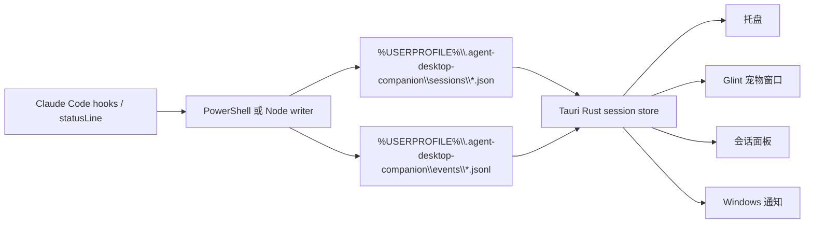

# Agent Desktop Companion

Agent Desktop Companion 是一个 Windows 优先、本地优先的 AI Agent 桌面伴随工作台。它的主入口是 **Glint**：一个带翅膀的微光科技小精灵宠物，用低打扰方式提示本地 agent 会话正在运行、已完成、失败，或需要人工介入。

当前版本重点支持 Claude Code CLI 会话，通过本地 hook/statusline 文件读取状态。更长期的定位是：用一个安静的桌面伴随入口，统一收纳 AI agent 会话状态、提醒、skills、API 配置和本地数据。

## 功能

- 从本地 JSON snapshot 跟踪多个 Claude Code 会话。
- 显示 `idle`、`running`、`tool_running`、`waiting_permission`、`waiting_input`、`done`、`error`、`stale`、`probably_closed` 和 `closed`。
- Message 模式只在授权、完成、失败时介入；Board 模式保留多会话状态看板。
- 内置 Glint 宠物：带翅膀的微光科技小精灵，使用 Codex/Hatch 8x9 atlas。
- 会话面板显示 project、cwd、session id、status、last event、last tool、heartbeat、context usage 和更新时间。
- Tauri v2 托盘支持打开面板、刷新、设置、勿扰、打开数据目录和退出。
- 透明、无边框、置顶、隐藏任务栏的宠物窗口。
- Windows PowerShell hook/statusline writer，另有 Node.js fallback。
- 默认本地状态目录：`%USERPROFILE%\.agent-desktop-companion`。
- 兼容读取旧的 `CLAUDE_SPROUT_HOME` 和 `%USERPROFILE%\.claude-sprout`。
- 支持导入包含 `pet.json` 和 `spritesheet.webp` 的 Codex-compatible 自定义宠物。
- Windows standalone exe、NSIS installer、release doctor 和 smoke 工具。

## 架构



## 数据目录

```text
%USERPROFILE%\.agent-desktop-companion\
  sessions\
    <session_id>.json
  events\
    <session_id>.jsonl
  pets\
    <pet_id>\
      manifest.json
      spritesheet.webp
  settings.json
```

兼容规则：

- 使用 `AGENT_DESKTOP_COMPANION_HOME` 可以覆盖数据根目录。
- 如果设置了 `CLAUDE_SPROUT_HOME`，应用和新 hook 会继续使用它。
- 如果新默认目录不存在，但 `%USERPROFILE%\.claude-sprout` 存在，应用会读取旧目录。
- 应用不会自动移动或删除旧本地数据。

## 开发

要求：

- 推荐 Windows 11。
- Node.js 20+。
- Rust stable 和 Tauri v2 原生构建依赖。
- 本仓库使用 `npm`。

安装并运行 Web 预览：

```powershell
npm install
npm run dev
```

Vite 页面只是开发预览。真正的桌面形态是 Tauri 的 `pet` 窗口：一个透明、无边框、悬浮在其他应用上方的轻量组件。完整会话面板是次级窗口，可以从 Glint 或托盘打开。

运行 Tauri：

```powershell
npm run tauri:dev
```

构建前端：

```powershell
npm run build
```

构建官方 Windows 发布产物：

```powershell
npm run release:exe
npm run release:nsis
```

创建 tag 前请先查看 [docs/release-checklist.md](docs/release-checklist.md)。

## Claude Code Hooks / Statusline

Claude Code command hooks 和 statusLine 都会从 stdin 接收 JSON，配置位置通常是 `~/.claude/settings.json`。

可以参考 [hooks/windows/claude-settings.example.json](hooks/windows/claude-settings.example.json)。使用时把 `C:/path/to/agent-desktop-companion` 替换成当前仓库路径，建议使用正斜杠路径；如果仓库路径包含空格，请保留 `.ps1` 路径外层的引号。

新的 canonical 文件：

- [hooks/windows/agent-desktop-companion-hook.ps1](hooks/windows/agent-desktop-companion-hook.ps1)
- [hooks/windows/agent-desktop-companion-statusline.ps1](hooks/windows/agent-desktop-companion-statusline.ps1)
- [hooks/node/agent-desktop-companion-hook.js](hooks/node/agent-desktop-companion-hook.js)
- [hooks/node/agent-desktop-companion-statusline.js](hooks/node/agent-desktop-companion-statusline.js)

旧的 `claude-sprout-*` hook 文件会作为 wrapper 保留一个发布周期，避免已有 Claude Code 配置立刻失效。

不要直接覆盖已有配置。如果设置了 `CLAUDE_CONFIG_DIR`，Claude Code 会读取 `<CLAUDE_CONFIG_DIR>\settings.json`；否则读取 `~\.claude\settings.json`。请先备份，再有意识地合并 `hooks` 和 `statusLine` 配置。

## 会话状态和宠物模式

从 Claude Code 用户的使用视角看，Agent Desktop Companion 关注两个集成点：

- Command hooks 会在 Claude Code 发生明确事件时运行：会话开始、提交 prompt、工具开始或结束、请求权限、本轮停止、失败、会话结束等。
- Statusline writer 会在 Claude Code 存活并刷新状态行时反复运行，用来刷新 heartbeat、context 百分比、显示名和最新保留状态。

Agent Desktop Companion 不会向 Claude Code 查询“当前有哪些会话”。它只读取 `%USERPROFILE%\.agent-desktop-companion\sessions` 下的本地 snapshot，或上面说明的兼容旧目录。

| 用户看到的时刻 | Claude Code 信号 | 存储状态 | Message 模式 | Board 模式 / 面板 | 通知和 Glint 表现 |
|---|---|---|---|---|---|
| 会话启动 | `SessionStart` | `idle` | 不弹卡片 | 安静会话 | 不通知，Glint idle |
| 提交 prompt | `UserPromptSubmit` | `running` | 不弹卡片 | 运行中 | 不通知，running 动画 |
| 工具开始 | `PreToolUse` | `tool_running` | 不弹卡片 | 显示工具元数据 | 不通知，running 动画 |
| 工具结束并继续 | `PostToolUse` | `running` | 不弹卡片 | 运行中 | 不通知，running 动画 |
| 需要授权 | `PermissionRequest` 或 `Notification: permission_prompt` | `waiting_permission` | 持续介入卡片 | 最高优先级 | 勿扰关闭时发通知，Glint 先挥动再等待 |
| 可能等待回复 | `Notification: idle_prompt` | `waiting_input` | 不弹卡片 | 低优先级弱状态 | 不发通知，不计入 action，不触发 waiting 动画 |
| 任务完成 | `Stop` | `done` | 完成卡片 | snapshot 存在时显示完成 | 勿扰关闭时发通知，Glint 跳一下后 idle |
| 任务失败 | `PostToolUseFailure` 或 `StopFailure` | `error` | 持续失败卡片 | 高优先级失败卡片 | 勿扰关闭时发通知，failed 动画 |
| 会话结束 | `SessionEnd` | `closed` | 不弹卡片 | Board 隐藏，面板历史可见 | 不通知；除非还有其他高优先级会话，否则 idle |
| 2 分钟无 heartbeat | 应用派生 | `stale` | 不弹卡片 | 低优先级 | 不通知，idle |
| 10 分钟无 heartbeat | 应用派生 | `probably_closed` | 不弹卡片 | 低优先级 | 不通知，idle |

强状态和终态在读取 snapshot 时会保留：`waiting_permission`、`done`、`error` 和 `closed` 不会因为时间久就自动变成 `stale` 或 `probably_closed`。

Message 模式是低打扰模式，只为 `waiting_permission`、`done` 和 `error` 显示富信息卡片。Board 模式是长期概览模式，会在宠物窗口中持续显示一定数量的未关闭会话，超过数量时显示翻页控制。

## Codex-Compatible Pet Importer

Agent Desktop Companion 会扫描：

- `%USERPROFILE%\.codex\pets`
- 设置了 `CODEX_HOME` 时的 `%CODEX_HOME%\pets`

导入包结构：

```text
<pet-id>/
  pet.json
  spritesheet.webp
```

导入后默认复制到 `%USERPROFILE%\.agent-desktop-companion\pets`，不会长期引用 Codex 原目录。首个 atlas profile 是 `codex-8x9`。

Agent Desktop Companion 不内置、复制或分发 Codex 官方宠物素材。请只导入你拥有或有权使用的自定义宠物包。Codex 是 OpenAI 的产品名称；本项目不是 OpenAI 官方项目。

## 隐私

Agent Desktop Companion 默认本地优先：

- 默认不做网络同步。
- 默认不采集完整 prompt/output。
- 不远程执行命令。
- 不自动批准 Claude Code 权限。
- session metadata 默认只保存在本地数据根目录，除非你手动移动。

详见 [docs/privacy.md](docs/privacy.md)。

## 免责声明

Agent Desktop Companion 是独立开源项目，不隶属于 Anthropic、Claude Code、OpenAI 或 Codex。

## Roadmap

- 用带 debounce 的文件监听替代 UI 轮询。
- 将伴随工作台扩展到 Claude Code 之外的 agent 状态。
- 在宠物优先体验稳定后加入 API 和 skill 管理。
- 准备并发布第一个 Windows tag release。
- 增加签名发布流程和 GitHub Actions release builds。

## License

MIT
