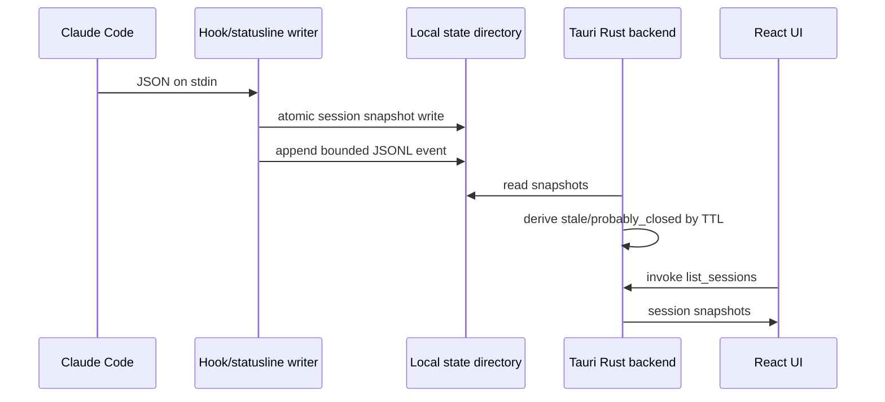

# Architecture

Claude Sprout uses Claude Code hooks for semantic events and the Claude Code statusline for heartbeat metadata.

## Boundaries

- Hooks never call the UI, network, or database.
- The renderer does not parse Codex pet files directly.
- Rust owns local data access, imports, and opening folders.
- React owns presentation and mock preview fallback.

## Refresh Policy

- File watcher target: refresh immediately, debounce 100-300 ms.
- Heartbeat target: statusline `refreshInterval` of 30 seconds.
- Stale target: heartbeat older than 2 minutes.
- Probably closed target: heartbeat older than 10 minutes.
- Event retention target: 1-5 MB per JSONL file, 7-day retention later.
