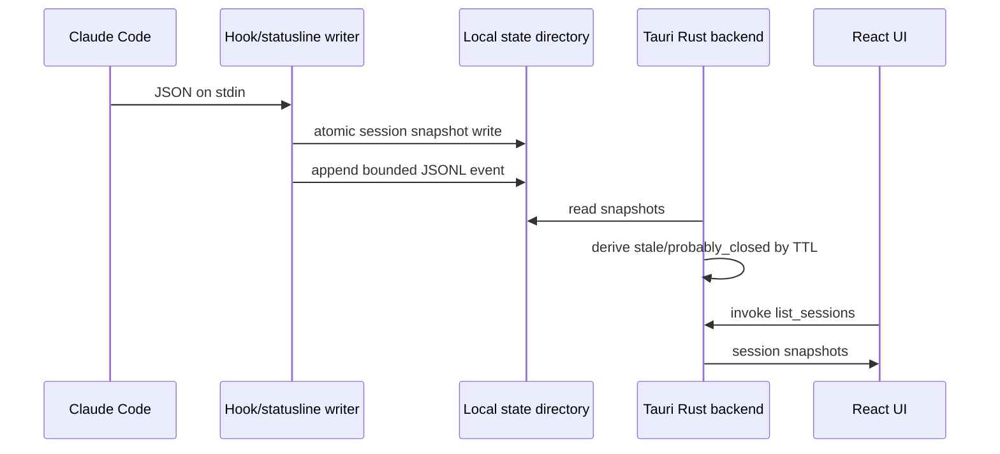

# Architecture

Agent Desktop Companion is a Windows-first Tauri v2 desktop companion for local AI Agent session awareness. The primary surface is Glint, a small transparent always-on-top pet window; the full session panel is secondary.

The first integration is Claude Code. It uses Claude Code hooks for semantic events and the Claude Code statusline for heartbeat metadata.

## Boundaries

- Hooks never call the UI, network, or database.
- The renderer does not parse Codex pet files directly.
- Rust owns local data access, imports, and opening folders.
- React owns presentation and mock preview fallback.
- Glint and the pet window remain the first-class surface; the session panel supports inspection and settings.
- The Tauri `pet` window is the primary surface: transparent, frameless, always-on-top, and taskbar-hidden.
- The Tauri `main` window is secondary and starts hidden; it opens from the pet or tray.
- The default local data root is `%USERPROFILE%\.agent-desktop-companion`.
- `AGENT_DESKTOP_COMPANION_HOME` overrides the data root. `CLAUDE_SPROUT_HOME` and `%USERPROFILE%\.claude-sprout` remain legacy compatibility paths and are not moved or deleted automatically.

## Refresh Policy

- File watcher target: refresh immediately, debounce 100-300 ms.
- Heartbeat target: statusline `refreshInterval` of 30 seconds.
- Stale target: heartbeat older than 2 minutes.
- Probably closed target: heartbeat older than 10 minutes.
- Event retention target: 1-5 MB per JSONL file, 7-day retention later.
